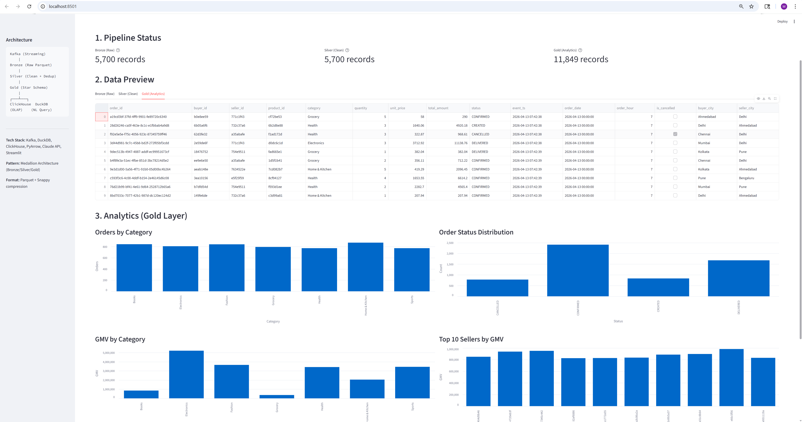

# Open-Commerce Lakehouse

A containerized streaming data lakehouse that simulates an open-network commerce marketplace end-to-end: Kafka streams order events through a **Bronze → Silver → Gold** Medallion pipeline, the Gold star-schema lands in **ClickHouse** for OLAP, and a **Streamlit** dashboard lets you ask questions in plain English (answered by Claude → SQL → DuckDB).



---

## Quickstart

### Prerequisites
- Docker Desktop
- Python 3.11+
- An [Anthropic API key](https://console.anthropic.com/) (only needed for the NL-query feature)

### 1. Clone and configure
```bash
git clone https://github.com/marshmallow16/open-commerce-lakehouse.git
cd open-commerce-lakehouse
cp .env.example .env          # then edit .env and paste your ANTHROPIC_API_KEY
```

### 2. Start the infrastructure
```bash
docker compose up -d
```
Brings up three containers:

| Container         | Purpose                                | Port         |
|-------------------|----------------------------------------|--------------|
| `ondc-kafka`      | Kafka broker (KRaft, no Zookeeper)     | 9092         |
| `ondc-kafka-ui`   | Browser UI to inspect Kafka topics     | 8080         |
| `ondc-clickhouse` | OLAP database for Gold-layer queries   | 8123, 9000   |

### 3. Install Python dependencies
```bash
python -m venv venv
venv\Scripts\activate          # Windows
# source venv/bin/activate     # macOS/Linux
pip install -r requirements.txt
```

### 4. Run the pipeline
```bash
# Generate and stream 500 fake order events
python pipeline/bronze/producer.py --rate 20 --total 500

# Drain Kafka to Bronze Parquet
python pipeline/bronze/consumer.py --batch-size 100

# Schema validation -> Silver transform -> Gold aggregate -> ClickHouse load
python run_pipeline.py
```

### 5. Launch the dashboard
```bash
streamlit run dashboard/app.py
```
Open **http://localhost:8501**. Use the auto-refresh dropdown to poll every 5 or 10 minutes, or hit **Refresh now** to re-read the Parquet layers on demand.

### Stop everything
```bash
docker compose down           # preserves data in Docker volumes
docker compose down -v        # wipes Kafka + ClickHouse state
```

---

## Architecture

```
  Kafka (KRaft)
        │     order events (JSON, keyed by seller_id)
        ▼
  Bronze ── raw Parquet, one file per batch, partitioned by date
        │     schema validation (JSON Schema) at the boundary
        ▼
  Silver ── dedup on order_id, type cast, null handling, derived fields
        │
        ▼
  Gold ──── star schema: fact_orders + dim_seller + dim_product + agg_seller_daily
        │
        ├──▶ ClickHouse  (OLAP queries, dashboards, BI)
        └──▶ DuckDB      (in-process, serves the NL-query engine)
```

### Layer responsibilities

| Layer  | Stores                          | Transformations                                              |
|--------|---------------------------------|--------------------------------------------------------------|
| Bronze | `data/bronze/date=YYYY-MM-DD/`  | None — raw events as received, Snappy-compressed Parquet.    |
| Silver | `data/silver/orders.parquet`    | Dedup on `order_id`, type cast timestamps, COALESCE nulls, derive `order_date` / `order_hour` / `is_cancelled` / `dq_flag`. |
| Gold   | `data/gold/*.parquet` + ClickHouse | Star schema: `fact_orders`, `dim_seller`, `dim_product`, pre-aggregated `agg_seller_daily`. |

### Natural-language query layer
`nl_query/engine.py` takes a plain-English question, asks Claude to generate SQL against the Gold schema, then executes it in DuckDB (in-process, no round-trip to ClickHouse). The dashboard wraps this in a text input so non-technical users can ask "Which category has the highest GMV?" and see both the generated SQL and the result.

---

## Tech stack & skills covered

| Area                       | Implementation                                          |
|----------------------------|---------------------------------------------------------|
| Streaming architecture     | Kafka (KRaft mode) producer + consumer, manual commits  |
| Medallion / Lakehouse      | Bronze → Silver → Gold pipeline                         |
| Columnar storage           | Parquet + Snappy compression at every layer             |
| Schema governance          | JSON Schema + validator flagging bad records            |
| Data modeling              | Star schema (facts + dimensions + pre-aggregations)     |
| OLAP                       | ClickHouse with init SQL + Python loader                |
| NL → SQL                   | Claude API via `anthropic` SDK                          |
| In-process analytics       | DuckDB over Parquet                                     |
| Dashboarding               | Streamlit with auto-refresh controls                    |
| Containerization           | Docker Compose orchestrating all three services         |
| Orchestration (lightweight)| `run_pipeline.py` as a minimal DAG runner               |

---

## Project layout

```
open-commerce-lakehouse/
├── docker-compose.yml       Kafka + Kafka UI + ClickHouse
├── run_pipeline.py          Silver + Gold one-shot runner
├── requirements.txt
├── .env.example             Copy to .env and fill in secrets
├── infra/
│   └── clickhouse/init.sql  Gold tables, auto-runs on first boot
├── pipeline/
│   ├── bronze/
│   │   ├── producer.py      Fake event generator -> Kafka
│   │   └── consumer.py      Kafka -> raw Parquet
│   ├── silver/
│   │   └── transform.py     Dedup, type cast, derive
│   └── gold/
│       └── aggregate.py     Star schema + ClickHouse load
├── schema/
│   ├── order_event.json     JSON Schema for governance
│   └── validate.py
├── nl_query/
│   └── engine.py            Claude -> SQL -> DuckDB
├── dashboard/
│   └── app.py               Streamlit dashboard
└── data/                    Generated Parquet (gitignored)
    ├── bronze/
    ├── silver/
    └── gold/
```

---

## Notes

- The `data/` directory is gitignored — clone the repo, run the pipeline, and you'll regenerate everything locally.
- The NL-query feature is the only part that calls an external API. Every other component runs fully offline once the Docker images are pulled.
- `docker compose down` preserves Kafka topic state and ClickHouse tables in named volumes; use `-v` to wipe them.
